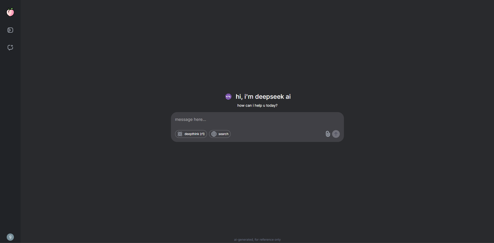

This is a [Next.js](https://nextjs.org) project bootstrapped with [`create-next-app`](https://github.com/vercel/next.js/tree/canary/packages/create-next-app).

https://ai-webapp-chi.vercel.app/

## Getting Started

First, run the development server:

```bash
npm run dev
# or
yarn dev
# or
pnpm dev
# or
bun dev
```

# ai-webapp

ai chatbot with deepseeek api



# backend packages

axios - to make api call

mongoose - to connect to mongodb db

openai - to make api call and get response from ai

svix - to manage clerk webhook and store userdata in db

# frontend packages

prismjs - to highlight syntax

react-hot-toast - display toast noti

react-markdown - structure the response that we are getting from ai
